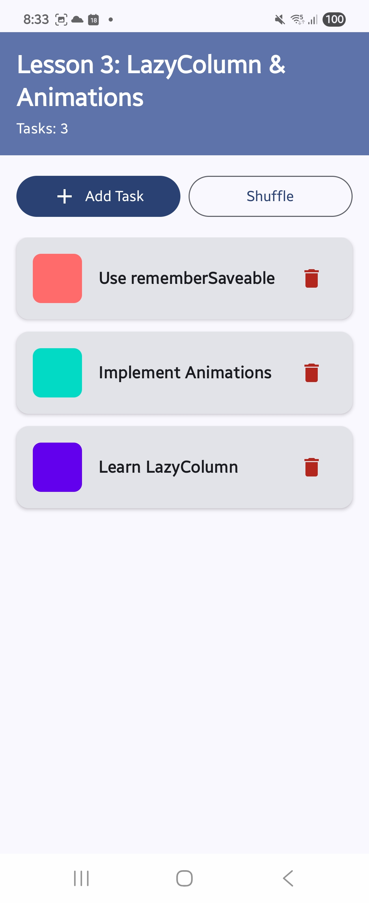
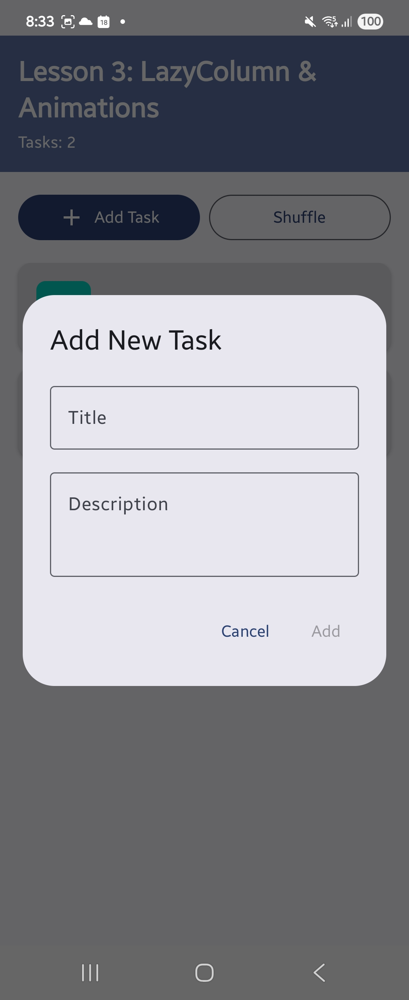

# Lesson 3: LazyColumn & Item Animations

> **Learning Focus:** LazyColumn, items(), animateItem(), rememberSaveable, and AnimatedVisibility

## 📱 Screenshots

<p align="center">
  
  
</p>

## 🎯 Learning Objectives

By the end of this lesson, you will understand:

1. **LazyColumn** - How to create efficient scrollable lists in Jetpack Compose
2. **Item Animations** - How to animate list items when they're added, removed, or reordered
3. **State Management** - How to preserve state across configuration changes
4. **Animated Visibility** - How to create smooth expand/collapse animations

---

## 🔑 Key Concepts

### 1. LazyColumn

**What is it?**  
`LazyColumn` is Compose's version of RecyclerView. It only composes and lays out items that are currently visible on screen, making it efficient for large lists.

```kotlin
LazyColumn(
    modifier = Modifier.fillMaxSize(),
    verticalArrangement = Arrangement.spacedBy(12.dp),
    contentPadding = PaddingValues(bottom = 16.dp)
) {
    items(
        items = tasks,
        key = { task -> task.id }  // ⭐ Important for animations!
    ) { task ->
        TaskItem(task = task)
    }
}
```

**Key Parameters:**
- `items` - The list of data to display
- `key` - Unique identifier for each item (essential for animations to work correctly)
- `verticalArrangement` - Spacing between items
- `contentPadding` - Padding around the content

---

### 2. animateItem() - Item Placement Animations

**What is it?**  
`animateItem()` is a modifier that automatically animates list items when they change position, appear, or disappear.

```kotlin
TaskItem(
    task = task,
    modifier = Modifier.animateItem(
        fadeInSpec = null,
        fadeOutSpec = null,
        placementSpec = spring(
            dampingRatio = Spring.DampingRatioMediumBouncy,
            stiffness = Spring.StiffnessLow
        )
    )
)
```

**Animation Types:**
- **Placement Animation** - Smoothly moves items to new positions (shuffle, delete)
- **Fade In/Out** - Controls appearance/disappearance animations (set to `null` in this example)
- **Spring Animation** - Creates a bouncy, natural movement effect

**Try it:** Click the "Shuffle" button and watch how items smoothly rearrange themselves!

---

### 3. rememberSaveable - State Preservation

**What is it?**  
`rememberSaveable` preserves state across configuration changes like screen rotation, process death, etc.

```kotlin
// ✅ Survives screen rotation
var tasks by rememberSaveable { mutableStateOf(generateInitialTasks()) }

// ❌ Would be lost on rotation
var tasks by remember { mutableStateOf(generateInitialTasks()) }
```

**When to use:**
- ✅ Use `rememberSaveable` for data you want to persist (task list, user input)
- ✅ Use `remember` for temporary UI state (animation states, scroll positions)

**Try it:** Add some tasks, rotate your device (Ctrl+F11/F12 in emulator), and see that your tasks are still there!

---

### 4. AnimatedVisibility - Expand/Collapse

**What is it?**  
`AnimatedVisibility` smoothly shows or hides content with customizable enter/exit animations.

```kotlin
var isExpanded by rememberSaveable { mutableStateOf(false) }

AnimatedVisibility(
    visible = isExpanded,
    enter = fadeIn() + scaleIn(),
    exit = fadeOut() + scaleOut()
) {
    Text(text = task.description)
}
```

**Animation Combinations:**
- `fadeIn() + scaleIn()` - Fades in while growing from center
- `fadeOut() + scaleOut()` - Fades out while shrinking
- Other options: `slideIn`, `expandVertically`, etc.

**Try it:** Click on any task card to expand/collapse the description!

---

## 🏗️ Project Structure

```
MainActivity.kt
├── MainActivity - Entry point
├── ListAnimationDemo - Main screen composable
│   ├── Header (task count)
│   ├── Action Buttons (Add, Shuffle)
│   └── LazyColumn (task list)
├── TaskItem - Individual task card
│   ├── Color indicator
│   ├── Title & expandable description
│   └── Delete button
└── AddTaskDialog - Dialog for creating new tasks
```

---

## 💡 Code Breakdown

### Data Model

```kotlin
data class Task(
    val id: Int,              // Unique identifier
    val title: String,        // Task title
    val description: String,  // Task description
    val color: Color          // Visual indicator color
)
```

### Main Features

#### 1. **Add New Tasks**
- Click "Add Task" button
- Enter title (required) and description (optional)
- New task appears with a random color
- Animation smoothly adds it to the list

#### 2. **Shuffle Tasks**
- Click "Shuffle" button
- Watch items animate to their new positions
- Uses spring animation for bouncy effect

#### 3. **Delete Tasks**
- Click the delete icon on any task
- Item smoothly animates out of the list
- Remaining items adjust positions automatically

#### 4. **Expand/Collapse**
- Click on a task card
- Description fades in/out with scale animation
- State preserved per task

---

## 🎓 Learning Exercises

### Exercise 1: Customize Animations
Try changing the animation parameters:
```kotlin
// Make it MORE bouncy
dampingRatio = Spring.DampingRatioHighBouncy

// Make it FASTER
stiffness = Spring.StiffnessHigh
```

### Exercise 2: Add Swipe to Delete
Research `SwipeToDismiss` and implement swipe gestures to delete tasks.

### Exercise 3: Add Task Priority
Add a priority field (High, Medium, Low) and sort tasks by priority.

### Exercise 4: Persistent Storage
Use DataStore or Room to save tasks permanently (not just across rotations).

---

## 🔍 Important Notes

### Why `key` is Important

```kotlin
items(
    items = tasks,
    key = { task -> task.id }  // ⭐ Must be unique and stable!
)
```

Without `key`:
- ❌ Animations won't work correctly
- ❌ Items might jump or flicker
- ❌ Wrong items might be recomposed

With `key`:
- ✅ Smooth animations when reordering
- ✅ Efficient recomposition
- ✅ Correct item identification

### OptIn Annotations

```kotlin
@OptIn(ExperimentalFoundationApi::class, ExperimentalMaterial3Api::class)
```

These annotations acknowledge that we're using experimental APIs that might change in future versions.

---

## 🚀 Running the Project

1. Open the project in Android Studio
2. Wait for Gradle sync to complete
3. Run the app on an emulator or physical device
4. Try all the features:
   - ➕ Add tasks
   - 🔀 Shuffle tasks
   - 🗑️ Delete tasks
   - 📖 Expand/collapse tasks
   - 🔄 Rotate the device to test state preservation

---

## 📚 Key Takeaways

1. **LazyColumn** is the go-to component for scrollable lists in Compose
2. **animateItem()** makes list animations trivial - no manual animation code needed
3. **rememberSaveable** is crucial for good UX - users expect their data to survive rotation
4. **AnimatedVisibility** provides easy enter/exit animations
5. Always provide a **unique key** for list items to enable proper animations

---

## 🔗 Further Reading

- [Compose Lists Documentation](https://developer.android.com/jetpack/compose/lists)
- [Compose Animation Documentation](https://developer.android.com/jetpack/compose/animation)
- [State in Compose](https://developer.android.com/jetpack/compose/state)
- [Material 3 Components](https://m3.material.io/)

---

## 📝 Next Steps

After mastering this lesson, you'll be ready for:
- **Lesson 4:** Navigation & Multi-Screen Apps
- **Lesson 5:** ViewModel & State Management
- **Lesson 6:** API Integration & Data Persistence

---

**Happy Learning! 🎉**

If you found this lesson helpful, practice by building your own list-based apps (Todo, Shopping List, Notes, etc.)

